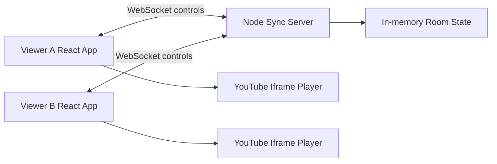

# WatchTogether

A free watch-party website built with React, CSS, browser WebSockets, Node.js, and the YouTube iframe player.

## What Works

- Create a room and get a 6-character room key.
- Join with the room key or invite URL.
- Paste a YouTube URL or video ID.
- Either viewer can play, pause, or seek.
- The server broadcasts playback state to every viewer in the room.
- Timestamp-based drift correction keeps players closely aligned.
- Mobile-safe playback controls apply locally first, then sync to the room.
- No paid database, auth provider, media server, or backend platform is required.

## Local Run

```bash
npm start
```

Open:

```text
http://localhost:3000
```

To test sync locally, open the same room in two browser windows.

## Checks

```bash
npm run check
npm run smoke
```

`npm run smoke` starts the server on a test port, loads the homepage, creates a room, opens two WebSocket clients, and verifies that a playback control event reaches the second client.

## Deploy

This project is ready for Node-compatible free hosting.

### Do Not Use Vercel For The Full App

Vercel is excellent for static sites and serverless HTTP APIs, but this project needs a persistent WebSocket server for live room sync. Vercel Serverless Functions do not support acting as a long-running WebSocket server, so rooms may create locally but deployed sync will close on `vercel.app`.

Use Render, Railway, Fly.io, or another host that runs a normal Node server process.

### Recommended Free Deployment: Render

1. Create a free GitHub account if you do not already have one.
2. Create a new GitHub repository named `watchtogether`.
3. Upload or push this project folder to that repository.
4. Create a free Render account at `https://render.com`.
5. Click `New +` and choose `Web Service`.
6. Connect your GitHub repository.
7. Select the free instance type.
8. Render can read `render.yaml`, or you can enter the settings below manually.

Render settings:

```text
Build command: npm install --omit=dev
Start command: npm start
Health check path: /api/health
```

After deploy, open the Render URL in two browsers or two devices. Create a room on one device and join with the key on the other.

Important: free Render services can sleep when unused. The first visit after sleep may take a little time to wake up.

### Git Commands

If you use Git from this folder:

```bash
git init
git add .
git commit -m "Build WatchTogether"
git branch -M main
git remote add origin https://github.com/YOUR_USERNAME/watchtogether.git
git push -u origin main
```

### Docker

```bash
docker build -t watchtogether .
docker run -p 3000:3000 watchtogether
```

### Heroku-style Hosts

The included `Procfile` runs:

```text
web: npm start
```

## System Design



Each room stores:

- `videoId`
- `videoUrl`
- `status`
- `position`
- `updatedAt`
- `lastActionId`
- `hostId`

The server is the source of truth. When a viewer sends play, pause, seek, or load, the server updates the room state and broadcasts it to the room. Browsers apply that state to the local YouTube player and seek if the local player drifts too far.

## Production Notes

No normal web app can promise literal 0% error probability or true zero-delay playback over the public internet. Network latency, browser scheduling, YouTube buffering, blocked embeds, and device speed can all vary. This app is built with practical safeguards: validation, health checks, timestamp correction, copy/error handling, room cleanup, and smoke tests.

Mobile browsers can block remote autoplay with sound until the user taps the page. WatchTogether handles this by showing a `Start synced video` button on that device when needed. After that tap, laptop-to-mobile, mobile-to-laptop, and mobile-to-mobile controls stay synced.

For a public product, the next production upgrades are:

- Persistent room storage with a free database tier or SQLite on a persistent volume.
- Rate limiting for room creation and control events.
- HTTPS through the hosting provider.
- Optional auth if private rooms are needed.
- Monitoring and server logs.
